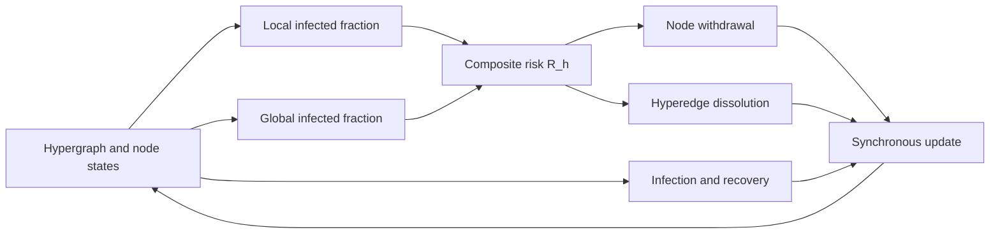
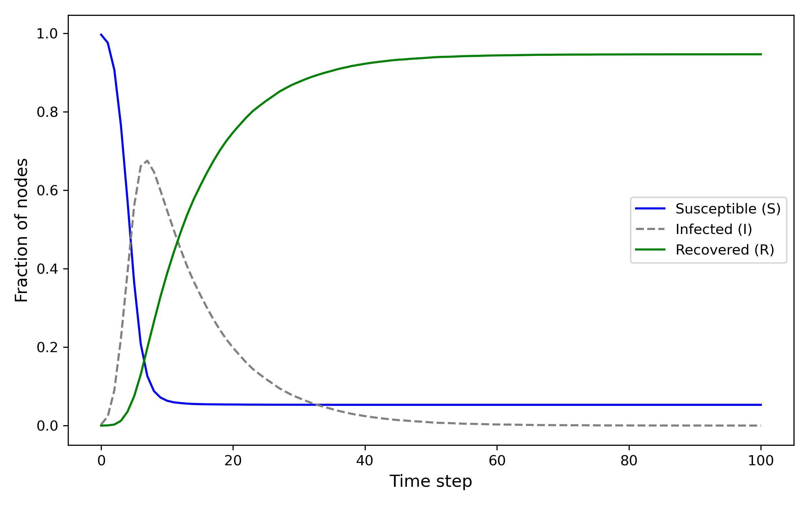
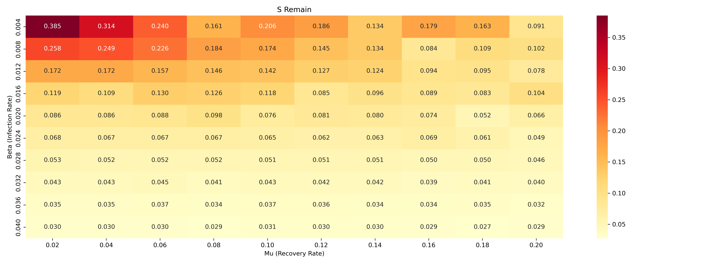

# HSIR: Multi-Risk-Aware Adaptive Link Breaking on Hypergraphs

**Outstanding Project for the AI for Complex Networks Course**

**Project authors:** Han Feiyang and Zihan Shen  
**Repository maintainer:** Zihan Shen

This repository presents an agent-based **hypergraph SIR (HSIR)** model for studying how higher-order contagion changes when susceptible individuals react to both local exposure and global prevalence. The model couples disease-state transitions with adaptive changes to hypergraph structure, allowing individual withdrawal from risky groups and probabilistic dissolution of high-risk groups.

> **Release history.** The initial code was developed locally during the Fall Semester of Academic Year 2025–2026 without a commit-by-commit version history. This repository provides a curated release of the original codebase.

## Highlights

- **Higher-order contagion:** transmission is modeled inside hyperedges, preserving group interactions that a pairwise graph projection would discard.
- **Multi-scale risk perception:** each hyperedge combines its local infected fraction with the global infected fraction.
- **Adaptive topology:** susceptible nodes may leave risky hyperedges, while hyperedges above a risk threshold may dissolve.
- **Controlled comparison:** the parameter sweep contrasts adaptive link breaking with a fixed-topology baseline over infection and recovery rates.
- **Monte Carlo evaluation:** the bundled experiments average stochastic trajectories and final susceptible fractions across repeated runs.

## Model

For a hyperedge $h$, the perceived risk is

$$
R_h = (1-\alpha)\frac{I_h}{\lvert h \rvert} + \alpha\frac{I}{N}.
$$

where $I_h/\lvert h \rvert$ is the local infected fraction, $I/N$ is global prevalence, and $\alpha$ controls their relative weight. At each discrete time step, the implementation evaluates four mechanisms:

1. A susceptible node in $h$ becomes infected with probability $\beta I_h^\gamma$.
2. An infected node recovers with probability $\mu$.
3. A susceptible node leaves $h$ with probability $\delta R_h$.
4. If $R_h > \phi$, the hyperedge dissolves with probability $\eta$.

State and topology changes are then applied synchronously.



## Results included in the course project

The following images are the output artifacts bundled with the original course-project ZIP. They are retained as historical experiment outputs and are not presented as a fresh rerun of the complete parameter sweep.

### Average HSIR trajectory



### Gain in final susceptible fraction from adaptive link breaking

The stored comparison reports the largest gain, **0.385**, in the low-infection/low-recovery corner of the tested grid. The benefit decreases in more extreme regimes, suggesting that adaptive disconnection is most useful around a critical transition region.



The corresponding adaptive and fixed-topology heatmaps are available in [`docs/assets`](docs/assets/).

## Repository structure

```text
.
├── experiments/
│   ├── HSIR.py                  # averaged S/I/R trajectory
│   └── S_remain_heatmap.py      # adaptive vs fixed-topology sweep
├── data/
│   └── README.md                # dataset retrieval and placement
├── docs/
│   ├── assets/                  # original bundled output figures
│   ├── CODE_SCOPE.md            # included and excluded ZIP contents
│   └── source-manifest.json     # SHA-256 provenance records
├── scripts/
│   └── verify_release.py
└── tests/
    └── test_core.py
```

## Quick start

Python 3.10 or newer is recommended.

```bash
git clone https://github.com/Ailta666508/HSIR-Adaptive-Hypergraph.git
cd HSIR-Adaptive-Hypergraph
python -m venv .venv
source .venv/bin/activate
python -m pip install -r requirements.txt
```

Download `hyperedges-contact-high-school.txt` from the official [Cornell Higher-Order Network Data collection](https://www.cs.cornell.edu/~arb/data/contact-high-school-labeled/) and place it at:

```text
data/contact-high-school/hyperedges-contact-high-school.txt
```

Generate the averaged trajectory:

```bash
MPLBACKEND=Agg python experiments/HSIR.py --data contact-high-school
```

Generate the full adaptive-versus-fixed parameter sweep:

```bash
MPLBACKEND=Agg python experiments/S_remain_heatmap.py --data contact-high-school
```

The full heatmap experiment uses 100 parameter pairs, two topology conditions, 100 Monte Carlo runs, and 100 time steps; expect it to take substantially longer than the trajectory script.

## Validation

Run the lightweight unit tests and release-integrity checks:

```bash
python -m pytest -q
python scripts/verify_release.py
```

The release was also checked by running the full `HSIR.py` trajectory experiment on the archived dataset. See [`docs/VALIDATION.md`](docs/VALIDATION.md) for the environment, output, and boundary of that check. The tests use a tiny synthetic hypergraph and do not replace reproduction on the published dataset. The original scripts seed NumPy with `42`, but node identifiers are first collected in a Python `set`; ordering can therefore vary between interpreter processes unless `PYTHONHASHSEED` is fixed.

## Dataset and scope

The course experiment uses the labeled `contact-high-school` hypergraph: 327 nodes, 7,818 hyperedges, mean hyperedge size 2.3, and maximum size 5, according to the [official dataset page](https://www.cs.cornell.edu/~arb/data/contact-high-school-labeled/). Raw data are not redistributed here because the source page does not state a repository-compatible redistribution license. See [`data/README.md`](data/README.md) for citations and setup instructions.

The report and presentation PDFs are also excluded because the course copies contain student identifiers. Deprecated, duplicate, or third-party-attributed files from the ZIP are omitted; the exact decisions are documented in [`docs/CODE_SCOPE.md`](docs/CODE_SCOPE.md).

## Limitations

- Link removal is irreversible; reconnection and memory effects are not modeled.
- Behavioral parameters are exploratory rather than calibrated from longitudinal observations.
- The global-risk term uses aggregate prevalence rather than a separate information-spreading process.
- The stored figures are release artifacts. Exact numerical reproduction depends on environment, data ordering, and random-state control.

## Authorship and repository contribution

The underlying course project was completed by **Han Feiyang and Zihan Shen**. **Zihan Shen** curated and maintains this GitHub release. GitHub's contributor list reflects commit authorship for the curated repository and should not be interpreted as sole authorship of the research project.

No open-source license is granted by this repository. Please contact the project authors before reusing the code.
