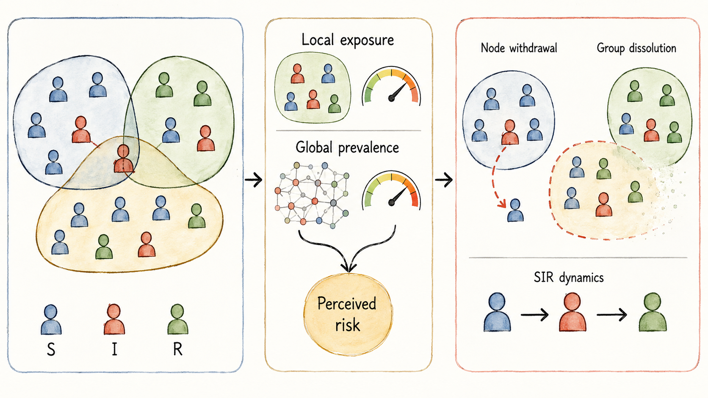
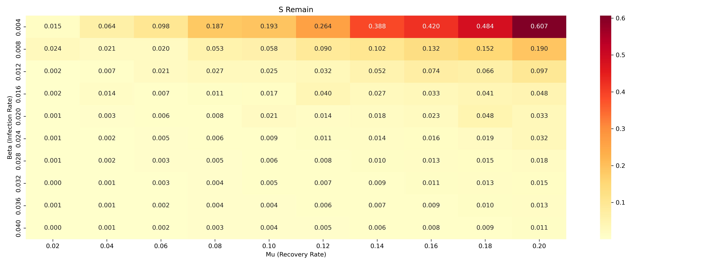
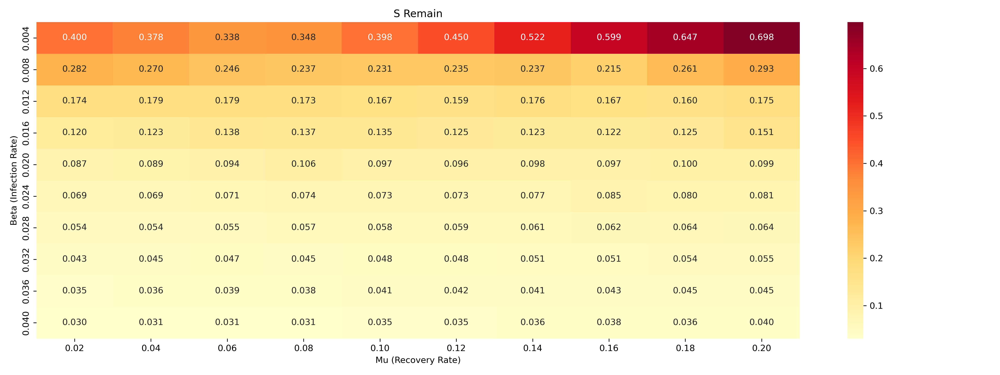

<h1 align="center">HSIR</h1>

<h3 align="center">Multi-Risk-Aware Adaptive Link Breaking and Spreading Dynamics on Hypergraphs</h3>

<p align="center">
  Outstanding Project for the <strong>AI for Complex Networks</strong> course
</p>

<p align="center">
  <strong>Han Feiyang</strong> · <strong>Zihan Shen</strong>
</p>

<p align="center">
  <a href="#overview">Overview</a> ·
  <a href="#model">Model</a> ·
  <a href="#experiments-and-results">Results</a> ·
  <a href="#quick-start">Quick Start</a> ·
  <a href="#reproducibility">Reproducibility</a> ·
  <a href="#citation">Citation</a>
</p>

## Overview

HSIR is an agent-based hypergraph epidemic model in which disease states and group structure evolve together. It retains higher-order group interactions, combines local exposure with global prevalence, and lets susceptible individuals withdraw from risky groups while high-risk hyperedges can dissolve.

<p align="center">
  
</p>

<p align="center"><em>Conceptual overview of HSIR. Overlapping enclosures denote hyperedges; blue, red, and green nodes denote susceptible, infected, and recovered states.</em></p>

The project studies two questions: how behavioral responses driven by information at different scales reshape higher-order contagion, and where adaptive link breaking provides the largest protection relative to a fixed topology.

### Main ideas

- **Higher-order contagion.** Infection is evaluated inside hyperedges instead of reducing group contacts to pairwise edges.
- **Multi-scale risk perception.** Each group combines its local infected fraction with the prevalence across the full network.
- **Two levels of adaptation.** Susceptible nodes may leave risky groups, and sufficiently risky hyperedges may dissolve.
- **Coupled synchronous dynamics.** Monte Carlo event decisions are computed from the current state, then node states and topology are updated together.
- **Controlled parameter study.** Adaptive and fixed-topology variants are compared over the same infection and recovery grid.

## Model

For hyperedge $h$, HSIR defines perceived risk as

$$
R_h = (1-\alpha)\frac{I_h}{\lvert h \rvert} + \alpha\frac{I}{N},
$$

where $I_h / \lvert h \rvert$ is the infected fraction within the hyperedge, $I/N$ is global prevalence, and $\alpha$ controls their relative weight.

At each discrete time step, the simulator evaluates four mechanisms from the current system state:

1. A susceptible node in $h$ becomes infected with probability $\beta I_h^\gamma$.
2. An infected node recovers with probability $\mu$.
3. A susceptible node leaves $h$ with probability $\delta R_h$.
4. If $R_h > \phi$, the hyperedge dissolves with probability $\eta$.

All accepted state and topology changes are applied before the next time step.

## Experiments and results

The course study uses the labeled `contact-high-school` network from the [Cornell Higher-Order Network Data collection](https://www.cs.cornell.edu/~arb/data/contact-high-school-labeled/). The dataset contains 327 nodes and 7,818 hyperedges, with a mean hyperedge size of 2.3 and a maximum size of 5.

The parameter study scans a 10 × 10 grid with $\beta \in [0.004, 0.04]$ and $\mu \in [0.02, 0.20]$. Each setting uses 100 Monte Carlo runs and 100 time steps. The adaptive condition uses $\delta=0.1$ and $\eta=0.3$; the fixed-topology baseline sets both values to zero. The evaluation metric is the final susceptible fraction, $S_{\mathrm{remain}}$.

The four figures below are the experiment figures used in the course paper and preserved unchanged from the original project archive. They document the reported study rather than a fresh rerun performed for this repository release.

### Epidemic trajectory

<p align="center">
  
</p>

<p align="center"><em>Figure 1. Average S/I/R trajectory over 100 independent runs on the contact-high-school hypergraph.</em></p>

### Fixed-topology baseline

<p align="center">
  
</p>

<p align="center"><em>Figure 2. Final susceptible fraction across the infection-recovery grid without node withdrawal or hyperedge dissolution.</em></p>

### Adaptive topology

<p align="center">
  
</p>

<p align="center"><em>Figure 3. Final susceptible fraction with multi-risk-aware node withdrawal and hyperedge dissolution.</em></p>

### Intervention gain

<p align="center">
  
</p>

<p align="center"><em>Figure 4. Absolute gain in final susceptible fraction: adaptive topology minus fixed topology.</em></p>

The archived grid reports a maximum absolute gain of **0.385** in final susceptible fraction in the low-infection, low-recovery region. The gain declines when transmission becomes too rapid for the adaptive response or when recovery alone already limits spread. These aggregate figures show where the mechanism is effective; they do not establish statistical significance or causal effectiveness in a real population.

## Repository structure

```text
.
├── experiments/
│   ├── HSIR.py                  # averaged S/I/R trajectory
│   └── S_remain_heatmap.py      # adaptive vs fixed-topology sweep
├── data/
│   └── README.md                # dataset retrieval and placement
├── docs/
│   ├── assets/                  # overview graphic and paper figures
│   ├── CODE_SCOPE.md            # release boundaries
│   ├── VALIDATION.md            # validation record
│   └── source-manifest.json     # hashes of original artifacts
├── scripts/
│   └── verify_release.py
└── tests/
    └── test_core.py
```

## Quick start

Python 3.10 or newer is recommended.

```bash
git clone https://github.com/Ailta666508/HSIR-Adaptive-Hypergraph.git
cd HSIR-Adaptive-Hypergraph
python -m venv .venv
source .venv/bin/activate
python -m pip install -r requirements.txt
```

Download `hyperedges-contact-high-school.txt` from the official [dataset page](https://www.cs.cornell.edu/~arb/data/contact-high-school-labeled/) and place it at:

```text
data/contact-high-school/hyperedges-contact-high-school.txt
```

Generate the averaged trajectory:

```bash
PYTHONHASHSEED=0 MPLBACKEND=Agg python experiments/HSIR.py --data contact-high-school
```

Generate the adaptive-versus-fixed parameter sweep:

```bash
PYTHONHASHSEED=0 MPLBACKEND=Agg python experiments/S_remain_heatmap.py --data contact-high-school
```

The full sweep evaluates 100 parameter pairs under two topology conditions, with 100 Monte Carlo runs and 100 time steps per condition, so it takes substantially longer than the trajectory script.

## Reproducibility

Run the lightweight synthetic tests and release-integrity checks with:

```bash
python -m pip install -r requirements-dev.txt
python -m pytest -q
python scripts/verify_release.py
```

The release was also smoke-tested on the archived `contact-high-school` data using the default trajectory configuration. [`docs/VALIDATION.md`](docs/VALIDATION.md) records the environment, checks, and validation boundary; [`docs/source-manifest.json`](docs/source-manifest.json) records SHA-256 hashes for the original code and paper figures.

The scripts seed NumPy with `42`, but node identifiers are collected in a Python `set`. Set `PYTHONHASHSEED` before launching Python when process-to-process node ordering must be stable.

## Limitations

- Link removal is irreversible; reconnection and memory effects are not modeled.
- Behavioral parameters are exploratory rather than calibrated from longitudinal observations.
- The global-risk term assumes immediate, accurate access to aggregate prevalence.
- The stored figures are historical project outputs. Exact reproduction depends on the data, environment, and random-state control documented above.

## Authorship and repository contribution

The course project was completed by **Han Feiyang** and **Zihan Shen**. **Zihan Shen** curated and maintains this public code release. GitHub's contributor list reflects commits to the curated repository and should not be interpreted as sole authorship of the underlying research project.

No open-source license is granted by this repository. Contact the project authors before reusing the code.

## Citation

If you use this code, cite the repository metadata in [`CITATION.cff`](CITATION.cff):

```bibtex
@software{han_shen_hsir_2026,
  author = {Han, Feiyang and Shen, Zihan},
  title = {HSIR: Multi-Risk-Aware Adaptive Link Breaking on Hypergraphs},
  year = {2026},
  url = {https://github.com/Ailta666508/HSIR-Adaptive-Hypergraph}
}
```

**Note:** This project was initially developed locally. The Git repository was created when the codebase was prepared for publication, so the early development history is unavailable. Subsequent updates are tracked in this repository.
